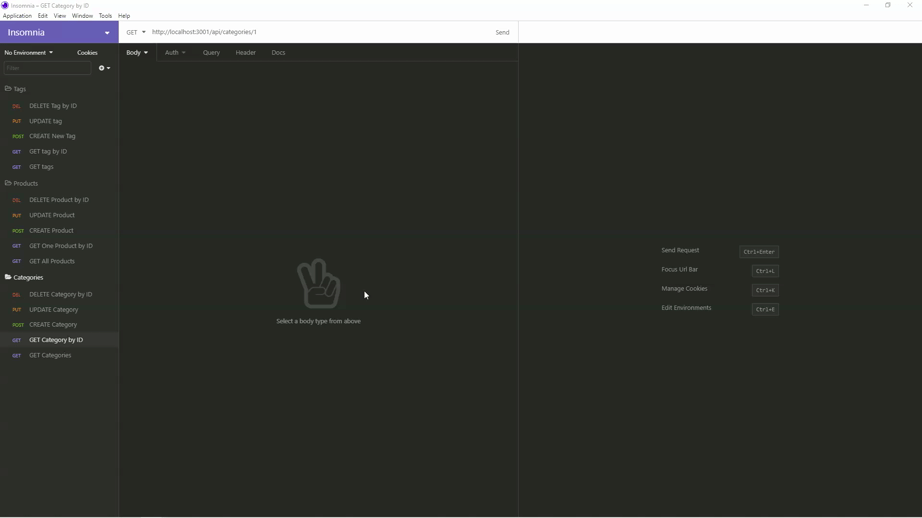

# e-commerce-back-end

    
  

  ## Description
  E-commerce Backend which is the back end for an e-commerce site and builded with Express.js API and configure it to use Sequelize to interact with a MySQL database. 

  The details for how this application works are in **Usage** and **Tests** sections.

  ## Table of Contents
  * [Installation](#installation)
  * [Usage](#usage)
  * [License](#license)
  * [Contributing](#contributing)
  * [Tests](#tests)
  * [Credits](#credits)
  * [Questions](#questions)

  ## Installation
  Instructions to get the application run: 
  1. Download and install [Visual Studio Code](https://code.visualstudio.com/Download) if user don't have it installed in the computer. 
  2. Download and install [Node.js](https://nodejs.org/en/) if user don't have it installed in the computer. 
  3. Open the terminal, first run `npm install mysql2`, `npm install sequelize`, `npm install dotenv` to install all three packages: 
     * `mysql2` to connect to MySQL database and perform queries.
     * `sequelize` is a promise-based Node.js ORM tool.
     * `dotenv` is a zero-dependency module that loads environment variables from a `.env` file into `process.env`. 

The application server itself runs by command `npm start`.

  ## Usage

  E-commerce Backend gives a functional Express.js API: 
  1. when user adds the database name, MySQL username, and MySQL password to an environment variable file, then user is able to connect to a database using Sequelize.
  2. when user enters schema and seed commands, then a development database is created and is seeded with test data. 
  3. when user enters the command to invoke the application, then my server is started and the Sequelize models are synced to the MySQL database.
  4. when user opens API GET routes in Insomnia Core for categories, products, or tags, then the data for each of these routes is displayed in a formatted JSON.
  5. when user test API POST, PUT, and DELETE routes in Insomnia Core, then user is able to successfully create, update, and delete data in my database.
  
  **The demo shows the server connection, the API testing are in Tests section**

   [E-commerce Backend Connect Schema, Seeds, and Start Server](https://drive.google.com/file/d/1XX2MAtaJ9et-ONkr3BFus-_lH7S59AWC/view)

   

  ## License
  
  This project is under license MIT
  
  [License Link](https://choosealicense.com/licenses/)

  ## Contributing
  Not Available 

  ## Tests

   The application's API routes being tested in Insomnia Core.

   [View All Categories, Products, and Tags](https://drive.google.com/file/d/1fUXOzQ89OwEmaHIlmQbk9txgYhf2sfx4/view)

   

   [View Single Category, Product, and Tag](https://drive.google.com/file/d/129K4pmmhyxbFcJLcThef79Gi0YSrnzjm/view)

   

   [Category Create, Update, and Delete](https://drive.google.com/file/d/16iIizQxRPSlhPz8yV5d_4xU77JZEV7J1/view)

   

   [Product Create, Update, and Delete](https://drive.google.com/file/d/1u5tLfqhuiCf6rdHOmnlYHYSMZXCM9jOs/view)

   

   [Tag Create, Update, and Delete](https://drive.google.com/file/d/1nLuvpNX3ZDWOYe_1rtwLses6Fsgs-Dsi/view)

   

  ## Credits
  The lists of resources used to complete this challenge: 
  1. Module 13 Object-Relational Mapping (ORM) from canvas. 
  2. Google (https://www.google.ca/) 
  3. MDN Web Docs (https://developer.mozilla.org/en-US/docs/Web/JavaScript).
  4. mysql2 (https://www.npmjs.com/package/mysql2).
  5. sequelize (https://www.npmjs.com/package/sequelize). 
  6. sequelize API (https://sequelize.org/v5/manual/models-definition.html#configuration). 
  7. dotenv (https://www.npmjs.com/package/dotenv).
  8. Supports from instructor, assistant instructor and Tutor.

  ## Questions

  For any questions, please contact me with the information below:

  GitHub: [@shanshantina](https://github.com/shanshantina)

  
  Email: tinaxu84@gmail.com